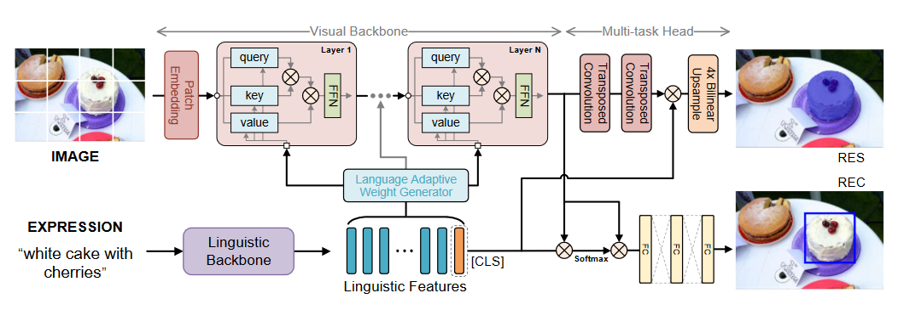
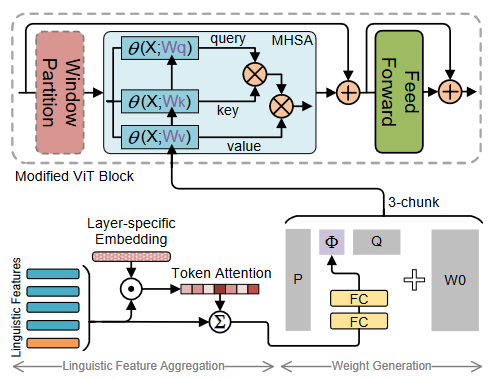
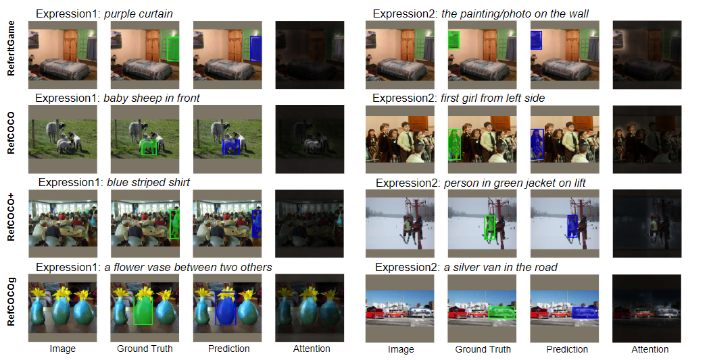
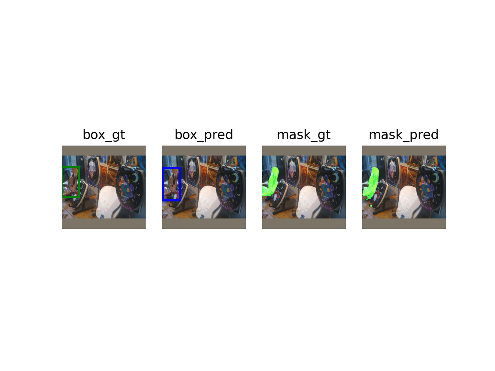

<a name="readme-top"></a>
ENGLISH|[简体中文](./README_CN.md)
<br />
<div align="center">

<h3 align="center">VG-LAW in MindSpore</h3>

  <p align="left">
    Although the impressive performance in visual grounding, the prevailing approaches usually exploit the visual backbone in a passive way, i.e., the visual backbone extracts features with fixed weights without expression-related hints. The passive perception may lead to mismatches (e.g., redundant and missing), limiting further performance improvement. Ideally, the visual backbone should actively extract visual features since the expressions already provide the blueprint of desired visual features. The active perception can take expressions as priors to extract relevant visual features, which can effectively alleviate the mismatches.
    <br />
  </p>
  <p align="left">
    Inspired by this, Xi Li Lab cooperated with the MindSpore team to conduct a series of innovative research, and proposed an active perception Visual Grounding framework based on Language Adaptive Weights, called VG-LAW. 
    <br />
    <br />
    <a href="https://arxiv.org/abs/2306.04652"><strong>arxiv »</strong></a>
    <br />
    <a href="https://openaccess.thecvf.com/content/CVPR2023/papers/Su_Language_Adaptive_Weight_Generation_for_Multi-Task_Visual_Grounding_CVPR_2023_paper.pdf"><strong>cvpr open access paper pdf »</strong></a>
  </p>
</div>


<!-- TABLE OF CONTENTS -->
<details>
  <summary>Table of Contents</summary>
  <ol>
    <li>
      <a href="#about-the-project">About The Project</a>
      <ul>
        <li><a href="#pipeline">Pipeline</a></li>
        <li><a href="#visualizations">Visualizations</a></li>
        <li><a href="#built-with">Built With</a></li>
      </ul>
    </li>
    <li>
      <a href="#getting-started">Getting Started</a>
      <ul>
        <li><a href="#setup-dataset">Setup Dataset</a></li>
        <li><a href="#training">Training</a></li>
        <li><a href="#eval&visualize">Eval&Visualize</a></li>
      </ul>
    </li>
  </ol>
</details>


<!-- ABOUT THE PROJECT -->
## About The Project

We propose an active perception visual grounding framework based on the language adaptive weights, called VG-LAW, which can actively extract expression-relevant visual features without manually modifying the visual backbone architecture.

Benefiting from the active perception of visual feature extraction, we can directly utilize our proposed neat but efficient multi-task head for REC and RES tasks jointly without carefully designed cross-modal interaction modules.

Extensive experiments demonstrate the effectiveness of our framework, which achieves state-of-the-art performance on four widely used datasets, i.e., RefCOCO, RefCOCO+, RefCOCOg, and ReferItGame.

<p align="right">(<a href="#readme-top">back to top</a>)</p>

### Pipeline
<div align="center">

  
  The overall architecture of our proposed VG-LAW framework.

    
  The detailed architecture for language adaptive weight generation.
</div>

<p align="right">(<a href="#readme-top">back to top</a>)</p>

### Visualizations
<div align="center">

  
  
</div>

<p align="right">(<a href="#readme-top">back to top</a>)</p>

### Built With

* [![Python][Python]][Python-url]
* [![MindSpore][MindSpore]][MindSpore-url]

<p align="right">(<a href="#readme-top">back to top</a>)</p>


<!-- GETTING STARTED -->
## Getting Started

This is an example of how you may give instructions on setting up your project locally.
To get a local copy up and running follow these simple example steps.

### Setup Dataset
Download the datasets and run `python tools/preprocess.py`.

More details [here](https://github.com/lichengunc/refer)


### Training
* Download the ViTDet,ViT-B Mask R-CNN model
```sh
cd checkpoint
wget link TODO
```
Running following commands to start trainning
```sh
mpirun -n DEVICE_NUM python src/train.py --batch_size=BATCH_SIZE --batch_sum=BATCH_SUM --dataset=DATASET_NAME --splitBy=SPLITBY --experiment_name=vglaw_DATASET --short_comment=vglaw_DATASET --law_type=svd --img_size=448 --vit_model=vitdet_b_mrcnn --pretrained_path=PRETRAINED_PATH --translate --lr_lang=1e-5 --lr_visual=1e-5 --lr_base=1e-4 --lr_scheduler=step --max_epochs=20 --drop_epochs=10 --log_freq=10 --use_mask --mode_name=PYNATIVE --save_ckpt_dir=SAVE_CKPT_DIR
```
or running the scripts after setting them up correctly. (DATASET can be refcoco/refcoco+/refcocog/refclef)
```sh 
sh scripts/train_DATASET.sh
```

<p align="right">(<a href="#readme-top">back to top</a>)</p>

### Eval&Visualize
<style>
table th:first-of-type {
    width: 40%;
}

table th:nth-of-type(3) {
    width: 40%;
}
table th:nth-of-type(4) {
    width: 50%;
}
</style>
|dataset        |REC(Prec@0.5)   |RES(mIoU)   |download|
|:-------------:|:--------------:|:----------:|:------:|
|refcoco  (val) |86.62           |75.62       |![law_fpt_vit_refcoco_shareSD_mt.ckpt][link TODO] |
|refcoco+ (val) |76.37           |66.63       |![law_fpt_vit_refcoco+_shareSD_mt.ckpt][link TODO]|
|refcocog (val) |76.90           |65.63       |![law_fpt_vit_refcocog_shareSD_mt.ckpt][link TODO]|
|refclef  (test)|77.22           |      -     |![law_fpt_vit_refclef_shareSD_mt.ckpt][link TODO] |

Use the above checkpoint or the checkpoint you trained yourself in `scr/eval_visualize.py` to obtain an image output.

Remember to make the correct settings first. (dataset/pretrained_path/indexes etc.)
```sh
python src/eval_visualize.py
```
Output to the folder named `visualize` by default. Like this.




<p align="right">(<a href="#readme-top">back to top</a>)</p>


<!-- MARKDOWN LINKS & IMAGES -->
[Python]: https://img.shields.io/badge/python-3.8-blue
[Python-url]: https://www.python.org/
[MindSpore]: https://img.shields.io/badge/MindSpore-2.1-blue
[MindSpore-url]: https://www.mindspore.cn/