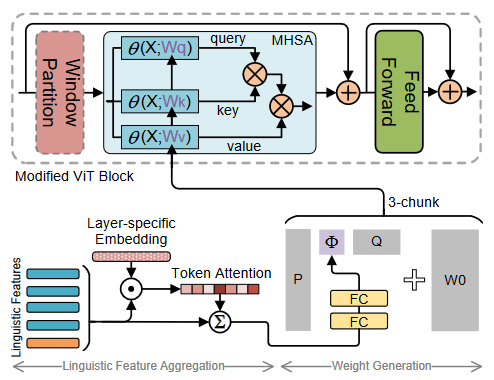
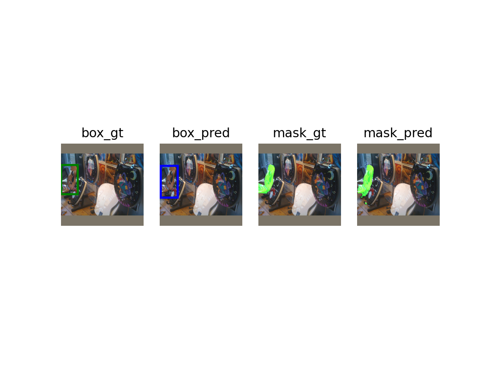

<a name="readme-top"></a>
[ENGLISH](./README.md)|简体中文
<br />
<div align="center">

<h3 align="center">VG-LAW in MindSpore</h3>

  <p align="left">
    尽管在视觉基础方面的表现已经相当出色，但主流方法通常以被动方式利用视觉主干，即视觉主干以固定权重提取特征，而没有考虑到与表达式相关的提示。这种被动感知可能导致不匹配（例如冗余和缺失），从而限制了性能的进一步提升。理想情况下，视觉主干应该主动地提取视觉特征，因为表达式已经提供了所需视觉特征的蓝图。主动感知可以将表达作为先验来提取相关的视觉特征，从而有效地缓解不匹配的问题。
    <br />
  </p>
  <p align="left">
    受此启发，李玺老师团队与MindSpore团队合作进行了一系列创新研究，提出了一种基于Language Adaptive Weights的主动感知Visual Grounding框架，简称为VG-LAW。
    <br />
    <br />
    <a href="https://arxiv.org/abs/2306.04652"><strong>arxiv »</strong></a>
    <br />
    <a href="https://openaccess.thecvf.com/content/CVPR2023/papers/Su_Language_Adaptive_Weight_Generation_for_Multi-Task_Visual_Grounding_CVPR_2023_paper.pdf"><strong>cvpr open access paper pdf »</strong></a>
  </p>
</div>


<!-- TABLE OF CONTENTS -->
<details>
  <summary>目录</summary>
  <ol>
    <li>
      <a href="#关于本文">关于本文</a>
      <ul>
        <li><a href="#pipeline">Pipeline</a></li>
        <li><a href="#可视化">可视化</a></li>
        <li><a href="#环境信息">环境信息</a></li>
      </ul>
    </li>
    <li>
      <a href="#使用示例">使用示例</a>
      <ul>
        <li><a href="#配置数据集">配置数据集</a></li>
        <li><a href="#训练">训练</a></li>
        <li><a href="#评估&可视化输出">评估&可视化输出</a></li>
      </ul>
    </li>
  </ol>
</details>


<!-- ABOUT THE PROJECT -->
## 关于本文

我们提出了一种基于语言自适应权重的主动感知视觉基础框架，简称为 VG-LAW，它可以主动提取与表达相关的视觉特征，而无需手动修改视觉主干架构。

受益于视觉特征提取的主动感知，我们可以直接利用我们提出的简洁但高效的多任务头联合执行 REC 和 RES 任务，而无需精心设计的跨模态交互模块。

大量的实验证明了我们的框架的有效性，它在四个广泛使用的数据集（即 RefCOCO、RefCOCO+、RefCOCOg 和 ReferItGame）上实现了最先进的性能。

<p align="right">(<a href="#readme-top">back to top</a>)</p>

### Pipeline
<div align="center">

  
  VG-LAW 框架的整体架构

    
  语言自适应权重生成的详细架构
</div>

<p align="right">(<a href="#readme-top">back to top</a>)</p>

### 可视化
<div align="center">

  
  
</div>

<p align="right">(<a href="#readme-top">back to top</a>)</p>

### 环境信息

* [![Python][Python]][Python-url]
* [![MindSpore][MindSpore]][MindSpore-url]

<p align="right">(<a href="#readme-top">back to top</a>)</p>


<!-- GETTING STARTED -->
## 使用示例

这个示例说明如何在本地设置项目。要获取本地副本并运           行，请按照以下简单的示例步骤操作。

### 配置数据集
下载所需的数据集并运行 `python tools/preprocess.py`。

更多细节请看 [这里](https://github.com/lichengunc/refer)


### 训练
* 下载 ViTDet,ViT-B Mask R-CNN 模型
```sh
cd checkpoint
wget link TODO
```
运行下面的代码以开始训练
```sh
mpirun -n DEVICE_NUM python src/train.py --batch_size=BATCH_SIZE --batch_sum=BATCH_SUM --dataset=DATASET_NAME --splitBy=SPLITBY --experiment_name=vglaw_DATASET --short_comment=vglaw_DATASET --law_type=svd --img_size=448 --vit_model=vitdet_b_mrcnn --pretrained_path=PRETRAINED_PATH --translate --lr_lang=1e-5 --lr_visual=1e-5 --lr_base=1e-4 --lr_scheduler=step --max_epochs=20 --drop_epochs=10 --log_freq=10 --use_mask --mode_name=PYNATIVE --save_ckpt_dir=SAVE_CKPT_DIR
```
或在正确设置后直接运行我们的脚本. (DATASET 可以是 refcoco/refcoco+/refcocog/refclef)
```sh 
sh scripts/train_DATASET.sh
```

<p align="right">(<a href="#readme-top">back to top</a>)</p>

### 评估&可视化输出
<style>
table th:first-of-type {
    width: 40%;
}

table th:nth-of-type(3) {
    width: 40%;
}
table th:nth-of-type(4) {
    width: 50%;
}
</style>
|dataset        |REC(Prec@0.5)   |RES(mIoU)   |download|
|:-------------:|:--------------:|:----------:|:------:|
|refcoco  (val) |86.62           |75.62       |![law_fpt_vit_refcoco_shareSD_mt.ckpt][link TODO] |
|refcoco+ (val) |76.37           |66.63       |![law_fpt_vit_refcoco+_shareSD_mt.ckpt][link TODO]|
|refcocog (val) |76.90           |65.63       |![law_fpt_vit_refcocog_shareSD_mt.ckpt][link TODO]|
|refclef  (test)|77.22           |      -     |![law_fpt_vit_refclef_shareSD_mt.ckpt][link TODO] |

在 `scr/eval_visualize.py` 中使用上面我们训练完成的 checkpoint 或是你自己训练的 checkpoint 以获得可视化的图片输出。

记得先进行正确的设置。 (如dataset/pretrained_path/indexes等)
```sh
python src/eval_visualize.py
```
图像会默认输出到`visualize`文件夹。如下所示。




<p align="right">(<a href="#readme-top">back to top</a>)</p>


<!-- MARKDOWN LINKS & IMAGES -->
[Python]: https://img.shields.io/badge/python-3.8-blue
[Python-url]: https://www.python.org/
[MindSpore]: https://img.shields.io/badge/MindSpore-2.1-blue
[MindSpore-url]: https://www.mindspore.cn/